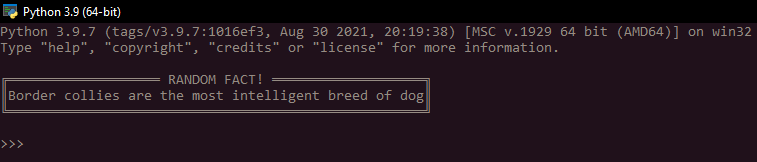
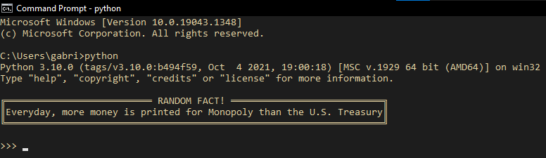

# facts
### Enjoy a random fact whenever you open a Python Interactive Environment.

## Notes
* facts is currently available to Windows OS only.
* Building `facts` overwrites the content of the `PYTHONSTARTUP` system environment
  variable to the filepath of `main.py`. Check if `PYTHONSTARTUP` is assigned to
  a necessary Python script before setting up `facts`.

## Setup
1. Make sure you have Python installed, preferably Python 3+. Visit 
   [this link](https://www.python.org/downloads/) to download the latest version
   of Python.

2. Clone this repo within your local directory via 
   `git clone https://github.com/Marshblocker/facts`.

3. Run `cmd` as an Administrator (**Important**) and, within 
   `your/local/directory/facts/`, execute `python build.py`. 
   If you change the location of `facts`, you need to repeat this step.

4. Setup is done. `facts` will run everytime you enter `python` in `cmd` or
   open the built-in Python shell. 

## License
facts is released under the [MIT License](https://opensource.org/licenses/MIT).